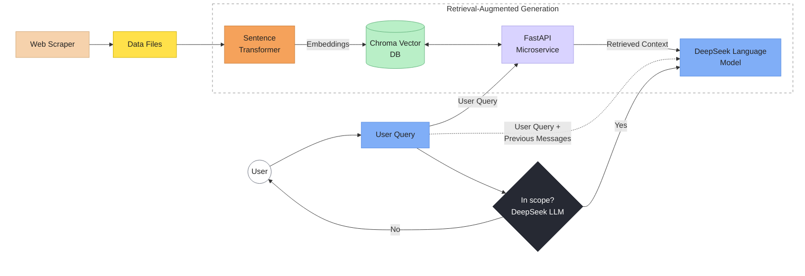

# High-Level Design

## Summary

- The frontend handles the chat experience and calls DeepSeek directly for scope check and answer generation.
- The Python backend handles retrieval by embedding the user query and searching ChromaDB for relevant product context.
- The scraper and `load_docs.py` prepare the knowledge base ahead of time from PartSelect product and repair pages.
- ChromaDB sits in the middle as the vector store used during live chat responses.
